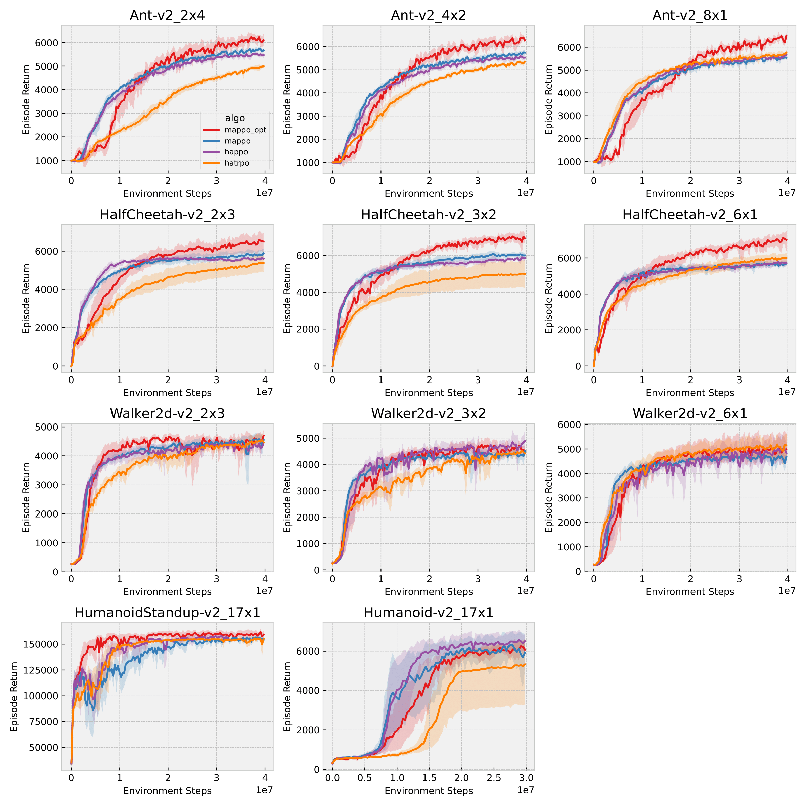

# Optimistic Multi-Agent Policy Gradient for Cooperative Tasks
This is the code for optimappo ([paper](https://arxiv.org/pdf/2311.01953), [website](https://wenshuaizhao.github.io/optimappo/)) which enables otpimism in multi-agent policy gradient methods by shaping the advantage estimation. This is a simple, but effective way to improve MAPPO on deterministic tasks by overcoming the **relative overgeneralization** problem.
## Installation
- Please refer to [MAPPO](https://github.com/marlbenchmark/on-policy) to install the python virtural environment. 
- We also need to install [Multi-Agent MuJoCo](https://github.com/schroederdewitt/multiagent_mujoco).

## Train your optimistic MAPPO (optimappo)
```
cd scripts
./train_mujoco_local.sh
```
## Expected results


## Citation
If you found this code is useful for your work, please cite our paper:
```
@inproceedings{zhao2024optimistic,
        title={Optimistic Multi-Agent Policy Gradient},
        author={Zhao, Wenshuai and Zhao, Yi and Li, Zhiyuan and Kannala, Juho and Pajarinen, Joni},
        booktitle={Proceedings of the International Conference on Machine Learning},
        year={2024}
      }
```