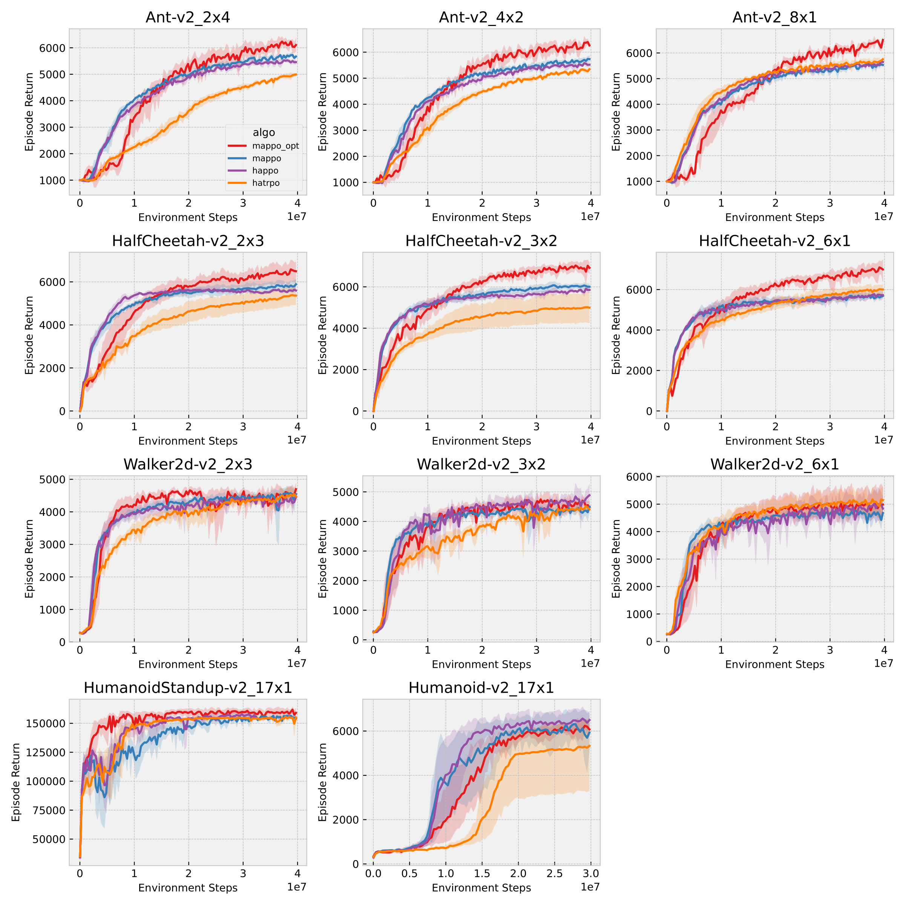

# Optimistic Multi-Agent Policy Gradient for Cooperative Tasks
This is the code for optimappo which enables otpimism in multi-agent policy gradient methods by shaping the advantage estimation. This is a simple, but effective way to improve MAPPO on deterministic tasks by overcoming the **relative overgeneralization** problem.
## Installation
- Please refer to [MAPPO](https://github.com/marlbenchmark/on-policy) to install the python virtural environment. 
- We also need to install [Multi-Agent MuJoCo](https://github.com/schroederdewitt/multiagent_mujoco).

## Train your optimistic MAPPO (optimappo)
```
cd scripts
./train_mujoco_local.sh
```
## Expected results


## Citation
```
@misc{zhao2023optimistic,
      title={Optimistic Multi-Agent Policy Gradient for Cooperative Tasks}, 
      author={Wenshuai Zhao and Yi Zhao and Zhiyuan Li and Juho Kannala and Joni Pajarinen},
      year={2023},
      eprint={2311.01953},
      archivePrefix={arXiv},
      primaryClass={cs.LG}
}
```